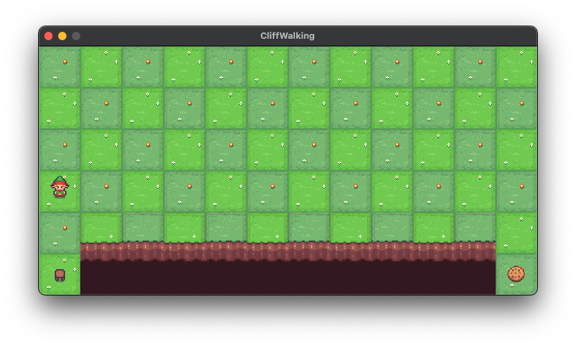

<p align="center">
  
  
</p>

# General Tree Evaluation for AlphaZero
[](https://github.com/albinjal/GeneralAlphaZero/actions/workflows/python-app.yml)


## Introduction
Welcome to the official repository for **General Tree Evaluation for AlphaZero**, a novel approach to enhancing model-based deep reinforcement learning. This repository contains the code and resources developed as part of the research that extends and refines the AlphaZero algorithm, particularly focusing on decoupling tree construction from action policies.





These plots demonstrate the empirical benefits of our proposed policies in classical Gym environments, especially under constrained simulation budgets.

## Capabilities
- Logging to TensorBoard
- Logging to Weights & Biases
- Customizable environment configurations
- ... and more!
## Getting Started
For a quick start, feel free to use the notebook [kaggle.ipynb](kaggle.ipynb) which should run on Kaggle/Google Colab with minimal setup. If you want to run the code locally, follow the instructions below.

### Local Installation
Start by cloning the repository:
```bash
git clone https://github.com/albinjal/GeneralAlphaZero.git
cd GeneralAlphaZero
```

You can set up the environment using either Pip or Conda. Choose one of the following methods to install the dependencies:

#### Using Pip

1. Create a virtual environment and activate it:
```bash
python3 -m venv venv
source venv/bin/activate  # On Windows use `venv\Scripts\activate`
```
2. Install the dependencies:
```bash
pip install -r requirements.txt
```

#### Using Conda
Create and activate the Conda environment:
```bash
conda env create -f environment.yml
conda activate az10
```


## Contribution
Contributions are welcome! Please open an issue or submit a pull request for any improvements, bug fixes, or new features.

## License
This project is licensed under the MIT License. See the [LICENSE](LICENSE) file for details.

Feel free to explore and modify the code, and don't hesitate to reach out if you have any questions or need further assistance. Happy coding!
